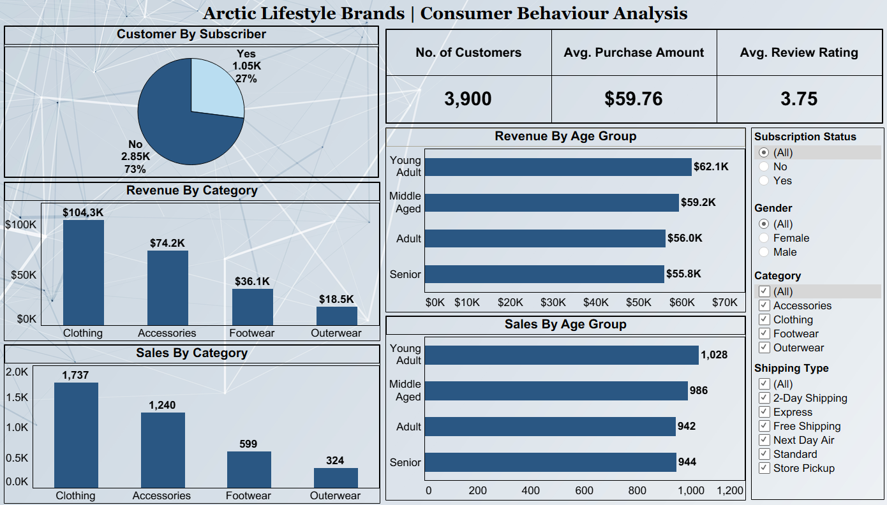

# Arctic Consumer Behaviour Analysis

# Company Name: Arctic Lifestyle Pvt. Ltd.

-----

### Tableau Public Dashboard Link:-
https://public.tableau.com/views/ArcticLifestyleBrandsConsumerBehaviourAnalysis/Dashboard?:language=en-US&:sid=&:redirect=auth&:display_count=n&:origin=viz_share_link

-----

### Project Summary:-
- Analyses customer shopping behaviour using transactional data from 3,900 purchases.
- Covers various product categories to guide strategic business decisions.
- Uncovers insights into spending patterns and customer segments.
- Examines product preferences and subscription behaviour.

-----
 
### Dataset Description (Processed Data):-
The dataset consists of 3900 records with 19 structured columns.

### Columns Name (Processed Data):-
- customer_id
- age
- gender
- item_purchased
- category
- purchase_amount
- location
- size
- color
- season
- review_rating
- subscription_status
- shipping_type
- discount_applied
- previous_purchases
- payment_method
- frequency_of_purchases
- age_group
- purchase_frequency_days

-----

### Tools Used:-
- Python (Jupyter Notebook)
- MySQL
- Tableau

-----

### Business Problem Statement:-
- A leading retail company wants to better understand its customers’ shopping behaviour to improve **Sales, Customer Satisfaction, and Long-Term Loyalty.*
- The management team has noticed changes in purchasing patterns across **demographics, product categories, and sales channels (online vs. offline).**
- They are particularly interested in uncovering which factors, such as discounts, reviews, seasons, or payment preferences, drive consumer decisions and repeat purchases.
- You are tasked with analysing the company’s consumer behaviours dataset to answer the following overarching business question:
    - **How can the company leverage consumer shopping data to identify trends, improve customer engagement, and optimize marketing and product strategies?**
 
-----

### Deliverables:- 
- **Data Preparation & Modelling (Python)**: Clean and transform the raw dataset for analysis.
- **Data Analysis (MySQL)**: Organize the data into a structured format, simulate business transactions, and run queries to extract insights on customer segments, loyalty, and purchase drivers.
- **Visualization & Insights (Tableau)**: Build an interactive dashboard that highlights key patterns and trends, enabling stakeholders to make data-driven decisions.
- **Report and Presentation**: Write a clear project report summarizing your key findings and business recommendations. Prepare a presentation that visually communicates insights and actionable recommendations to stakeholders.
- **GitHub Repository**: Include all Python scripts, SQL queries, and dashboard files in a well-structured repository.

-----

### KPIs:-
1) No. of Customers
2) Avg. Purchase Amount
3) Avg.  Review Rating

-----

### Dashboard Preview:-
 

-----

### Project Structure:-
- Arctic_Lifestyle_Brand
  - Analysis_Python/: Python Notebook.
  - Analysis_Report/: Report.
  - Analysis_SQL/: SQL Queries.
  - Dashboard/: "Arctic_Consumer_Behaviour_Analysis_Dashboard.twbx" file.
  - Data/: Raw and Processed Dataset.
  - Presentation/: "Arctic Consumer Behaviour Analysis.pptx" file.
  - Insights/: Business Insights & Recommendations.
  - README.md: Project Documentation.

-----

### Author:-
Yash Sonar
BBA Student | Aspiring Data Analyst

-----
